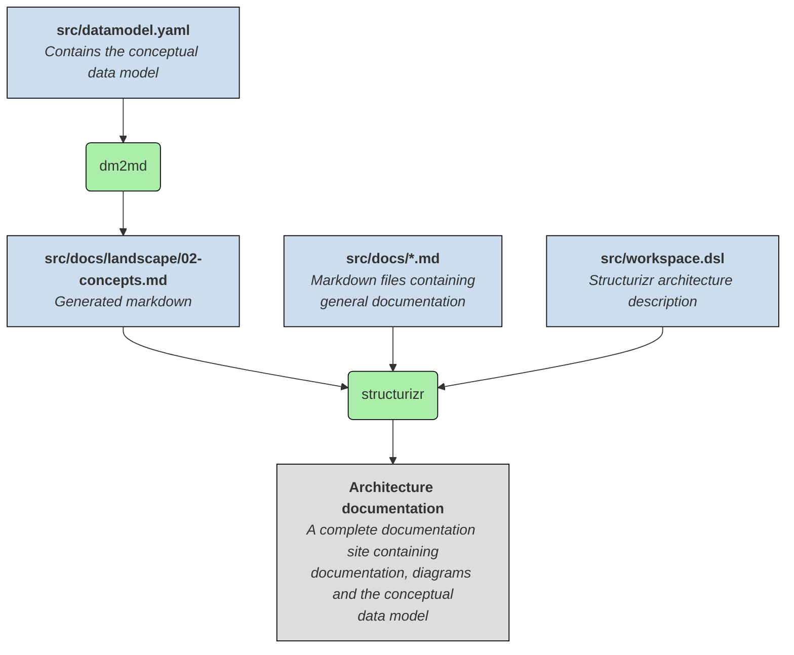

# Architecture documentation template

## How it works



## Prerequisites

* Docker
* Visual Studio Code
* Visual Studio Code plugins:
    * `ciarant.vscode-structurizr`
    * `yzhang.markdown-all-in-one`
    * `jebbs.plantuml`
    * (optional) `bierner.markdown-mermaid`

## Getting started

* Fork this repository
* Start docker containers (`docker compose up`)

* Edit the software model in `src/workspace.dsl`
* Edit the markdown documentation files in `src/docs/`
* Edit the conceptual data model in `src/datamodel.yaml`
* Preview markdown in Visual Studio Code
* Preview Structurizr output in browser http://127.0.0.1:8081/
* Stop docker containers (`docker compose down`)

## Schema of `datamodel.yaml`

```
datamodel:
  description: string
  entities:
    ENTITY_ID:
      name: string
      aka:                          #OPTIONAL
        - string
      shortDescription: string      #OPTIONAL
      description: string           #OPTIONAL
      properties:                   #OPTIONAL
        PROPERTY_NAME:
          description: string       #OPTIONAL
          type: string              #OPTIONAL
          values:                   #OPTIONAL
            - string
          examples:                 #OPTIONAL
            - string
          relations:                #OPTIONAL
            - to: ENTITY_ID
              description:          #OPTIONAL
              properties:           #OPTIONAL
                PROPERTY_NAME: {}
diagrams:
  - name: string
    type: overview OR details
    whitelist:                      #OPTIONAL
      - ENTITY_ID
    blacklist:                      #OPTIONAL
      - ENTITY_ID
    layout:
      DIAGRAM_ID:                   # overview or ENTITY_ID
        ENTITY_ID-ENTITY_ID: L, R, U or D
```