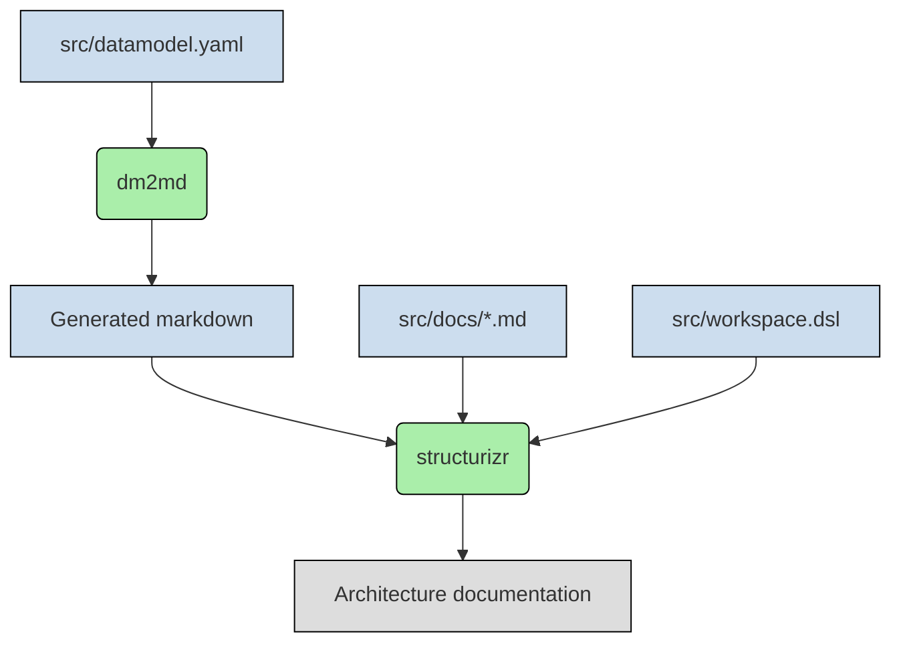

# Architecture documentation template

## How it works

## Prerequisites

* Docker
* Visual Studio Code
* Visual Studio Code plugins:
    * ciarant.vscode-structurizr
    * yzhang.markdown-all-in-one
    * jebbs.plantuml

## Getting started

* Fork this repository
* Start docker containers (`docker compose up`)
* Edit `src/workspace.dsl` and markdown files in `src/docs/`
* Preview markdown in Visual Studio Code
* Preview Structurizr output in browser http://127.0.0.1:8081/
* Stop docker containers (`docker compose down`)
